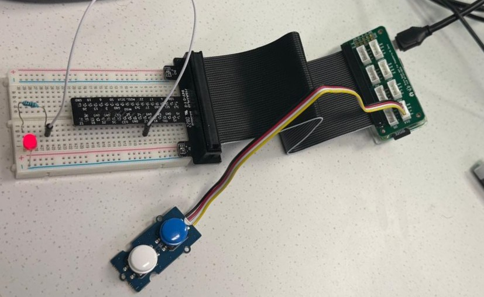
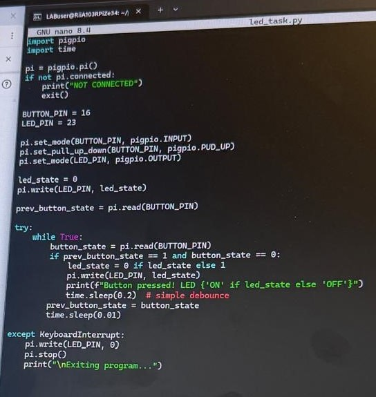
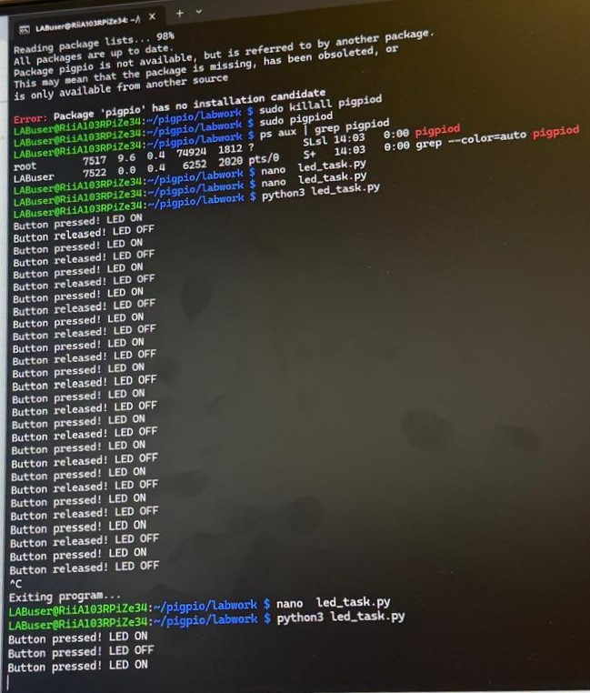

# LAB 2: GPIO INPUT AND OUTPUT

**University:** HAMK University of Applied Sciences, Riihimäki Campus 🇫🇮  
**Course:** Controllers and Electronics  
**Group Members:** Dipen Gaihre and Lotus Nyaupane  

---

## 1. Objectives
The goal of this lab was to learn how to use the Raspberry Pi to control electronic parts. We wanted to make an LED turn on and off (Output) and use a push button to send a signal to the Pi (Input).

## 2. Equipment and Materials
* Raspberry Pi 4
* Breadboard and Jumper wires
* Red LED
* Push Button
* 330 Ω Resistor
* Python (using the `pigpio` library)

## 3. Circuit Setup
We connected the hardware as follows:
* **LED:** Connected to **GPIO 23** with a resistor to protect it.
* **Button:** Connected to **GPIO 16**. We used the internal pull-up resistor in the Pi so the signal stays stable.

*Fig: Physical wiring of the button and LED to the Raspberry Pi.*

## 4. Python Programming
We wrote three different scripts for this lab:
1. **LED Blink:** Makes the LED turn ON and OFF 5 times.
2. **Button Test:** Checks if the button is being pressed or not.
3. **LED Task:** This is the main task where the button toggles the LED. When you press the button, the LED turns ON. When you press it again, it turns OFF.

*Fig: Screenshot of the integrated button and LED code.*

## 5. Results and Observations
The code worked successfully. In the terminal, we could see the message "Button pressed!" every time we pushed the blue button. 

*Fig: Terminal showing the button press and release states.*

**Challenges:** We had to make sure the `pigpiod` daemon was running before starting the code, otherwise the Python script would show a connection error.

## 6. Conclusions
We learned how to use GPIO pins for both input and output. By using the `pigpio` library, we created a simple system where a physical button controls an LED. This is a basic but important step for robotics.

---

## 📂 Project Contents
* **Python Code:** Located in the [/code](./code) folder.
* **Full Report:** [Download Week 2 Lab PDF](./report/week%202%20lab.pdf)
* **All Photos:** Located in the [/media](./media) folder.
