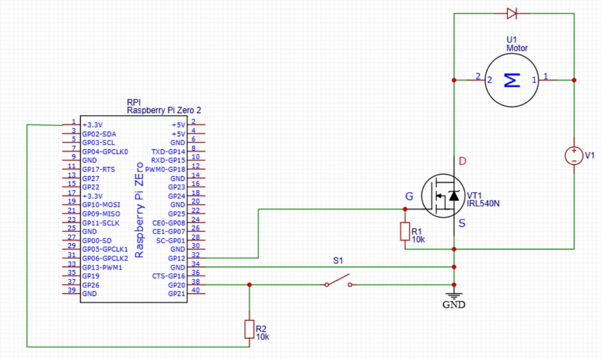
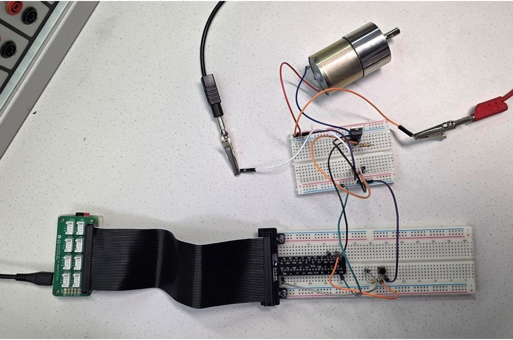
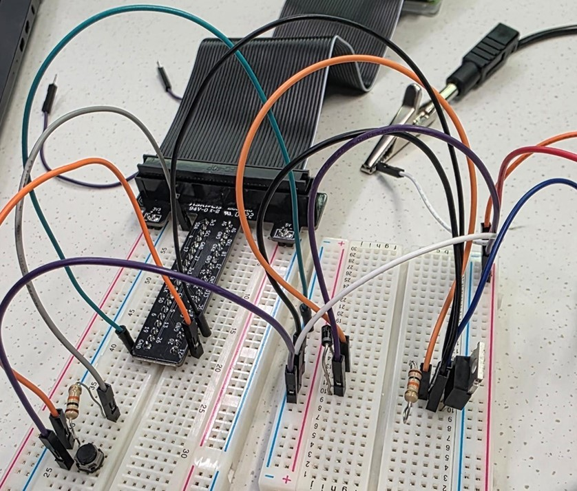
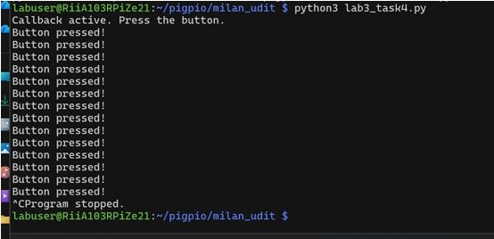

# LAB 3: MOTORS & MOSFETS

**University:** HAMK University of Applied Sciences  
**Course:** Controllers and Electronics  
**Group Members:** Milan Khadka, Udit Bhattarai, Lotus Nyaupane, and Dipen Gaihre  
**Date:** 28.11.2025

---

## 1. Objectives
The objective of this lab was to learn how to control a high-voltage (12V) DC motor safely using a Raspberry Pi and a MOSFET switch. Because the Pi cannot power a motor directly, we utilized an external power supply and an IRL540 N-channel MOSFET. 

Key objectives included:
* Building a manual pull-up resistor circuit for button input.
* Understanding MOSFET switching principles ($V_{GS(th)}$ logic levels).
* Implementing responsive motor control using event-driven (callback) programming.
* Using flyback diodes to protect the Pi from voltage spikes.

## 2. Equipment & Components
* **Raspberry Pi Zero 2W**
* **DC Motor (12V)** with **External 12V Power Supply**
* **IRL540 N-channel MOSFET** (Logic-level)
* **1kΩ and 10kΩ Resistors** (for external pull-up)
* **1N4007 Diode** (Flyback protection)
* **Push Button**
* **Python** with the `pigpio` library

## 3. Wiring and Setup
The circuit was designed to isolate the 12V motor supply from the 3.3V Pi logic.

* **MOSFET Gate:** Connected to **GPIO 12**.
* **Button Input:** Connected to **GPIO 20** with an external 10kΩ pull-up resistor.
* **Flyback Diode:** Connected across the motor to suppress back-EMF spikes.

### Hardware Gallery
| Circuit Schematic | Physical Setup | Pi Connections |
| :---: | :---: | :---: |
|  |  |  |

---

## 4. Tasks and Python Code
Below are the links to the scripts developed during this lab:

* **[Task 3: Basic Polling Control](./codes/lab3-task3-polling.py)** – A standard loop checking button states manually.
* **[Task 4: Callback-Based Control](./codes/lab3-task4-callback.py)** – An event-driven approach using `pi.callback` for instant responsiveness.

---

## 5. Results and Observations

### Pull-Up Resistor Verification (Task 2)
We verified the manual 10kΩ pull-up circuit. The terminal correctly displayed a stable "1" (HIGH) while idle and a "0" (LOW) when the button was pressed.

*Fig: Verifying the logic level of the external pull-up circuit.*

### Event-Driven Response (Task 4)
Using callbacks proved more efficient than polling. The program remained idle (saving CPU) until a "Falling Edge" was detected on the button pin.

*Fig: Logs showing successful callback execution upon button press.*

**Key Findings:**
* **Logic-Level MOSFET:** The IRL540 successfully switched the 12V load using the Pi’s 3.3V output thanks to its low threshold voltage ($V_{GS(th)}$).
* **Protection:** The flyback diode was essential; no reboots or noise issues were observed when the motor stopped abruptly.
* **Code Efficiency:** Task 4's callback method provided a significantly cleaner and more instant response compared to the polling loop in Task 3.

---

## 6. Conclusion
This lab successfully demonstrated how to bridge the gap between low-power microcontrollers and high-power mechanical loads. By building the pull-up circuit manually and using callbacks, we gained a deeper understanding of hardware-software interaction and circuit safety.

---

### 📂 Project Structure
* **[codes/](./codes/)**: Python scripts and `requirements.txt`.
* **[media/](./media/)**: Hardware photos and terminal screenshots.
* **[report/](./report/)**: Full PDF documentation (`Lab3_report_l.pdf`).
