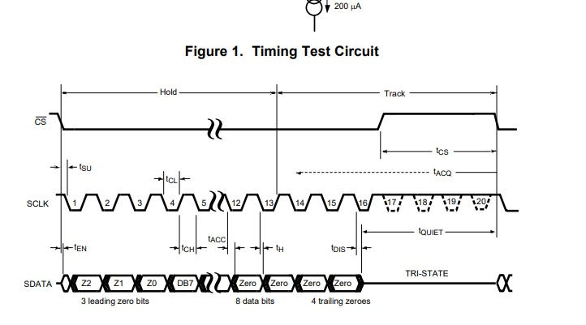
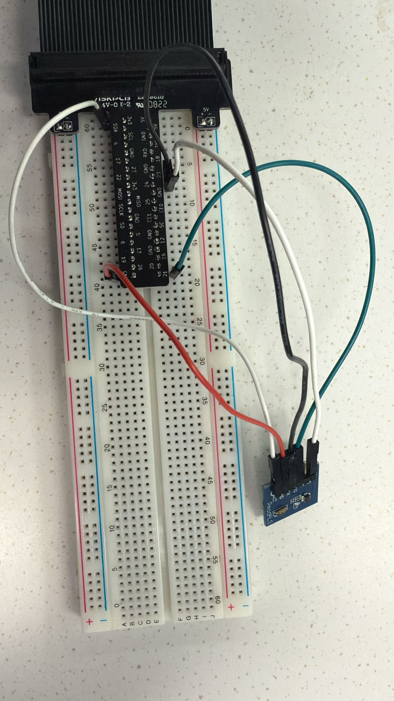
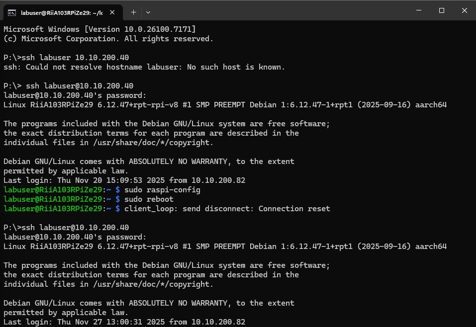
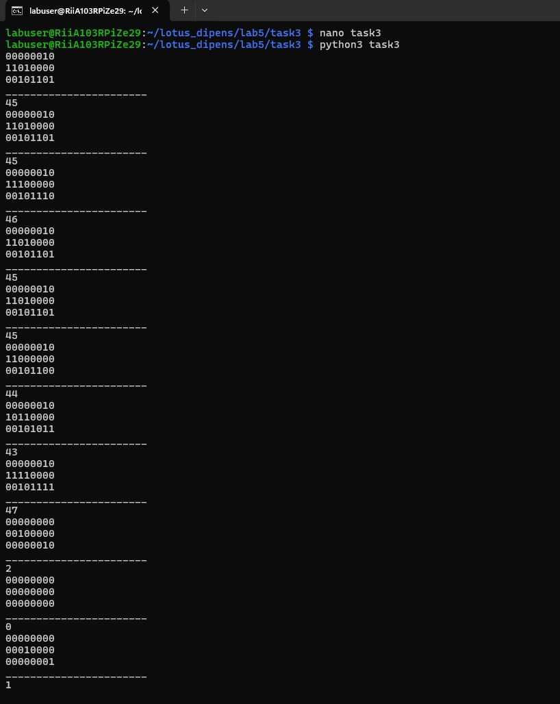
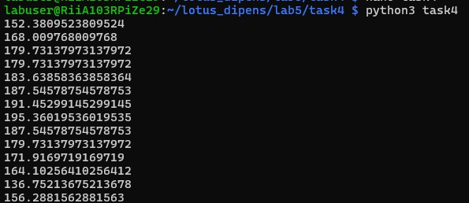

# LAB 5: AMBIENT LIGHT SENSOR (SPI)

**University:** HAMK University of Applied Sciences, Riihimäki Campus 🇫🇮  
**Course:** Controllers and Electronics  
**Group Members:** Dipen Gaihre and Lotus Nyaupane  

---

## 1. Objectives
The goal of this lab was to learn how to use **SPI (Serial Peripheral Interface)** communication on the Raspberry Pi. We used a **PmodALS** sensor to read light levels by practicing how to enable SPI, read raw binary data from an ADC, and convert that data into usable light values.

## 2. Equipment and Materials
* **Raspberry Pi Zero 2W**
* **PmodALS Ambient Light Sensor**
* **Breadboard and Jumper wires**
* **Pigpio library** and **Python**

## 3. Circuit Setup
We connected the PmodALS sensor to the Pi using the dedicated SPI pins. This setup requires a Master (Pi) and a Slave (Sensor) relationship:

* **CS (Chip Select):** Connected to **CE0** (GPIO 8).
* **MISO:** Connected to **GPIO 9**.
* **SCK (Clock):** Connected to **GPIO 11**.
* **Power:** Connected to **3.3V** and **GND**.

| Wiring Schematic | Lab Wiring Photo | SPI Config |
| :---: | :---: | :---: |
|  |  |  |

*Fig: Hardware wiring, sensor timing diagram, and SPI configuration on the Raspberry Pi.*

## 4. Python Programming
Our implementation progressed through three key stages to ensure stable data retrieval:

1. **[01_spi_initialization.py](./codes/task1_spi_init.py):** Opens the SPI channel at **1MHz** to establish a safe and stable connection.
2. **[02_bit_shifting_logic.py](./codes/task3_bit_manipulation.py):** Captures the two bytes sent by the sensor and uses bit-shifting to align the 8-bit value.
3. **[03_final_light_monitor.py](./codes/task4_light_sensor.py):** Continuously monitors and prints the final light intensity (0-255).

 **The core bit manipulation logic used to extract the 8-bit value:**
cleaned_bit1 = b1 << 4        # Aligning the first byte
cleaned_bit2 = b2 >> 4        # Aligning the second byte
combined = cleaned_bit1 | cleaned_bit2 # Final combined light level

## 5. Results and Observations
The sensor successfully detected light changes during our tests. We observed that values dropped to **0** when the sensor was covered and increased toward **255** when exposed to bright light.

| Binary/Decimal Output | Integrated Sensing |
| :---: | :---: |
|  |  |

*Fig: Terminal output showing binary data conversion and real-time sensor results.*

**Challenges:** We learned that hardware SPI must be enabled via `sudo raspi-config` and the Pi must be rebooted before communication is possible. We also had to use the datasheet to identify which bits were important and which were padding.

## 6. Conclusions
We successfully moved from simple GPIO signals to the SPI protocol. This lab taught us how to handle binary data streams and how to use bit manipulation to process information from digital sensors - a vital skill for advanced robotics and electronics.

---

## 📂 Project Contents
* **Python Code:** Located in the [codes/](./codes) folder.
* **Full Report:** [Lab5_Final_Report.pdf](./reports/Lab-5.pdf)
* **All Photos:** Located in the [media/](./media) folder.
