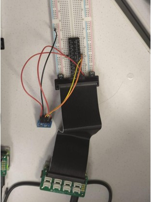
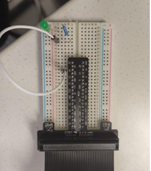
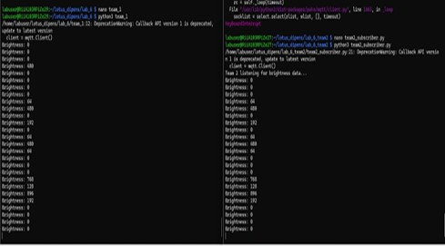
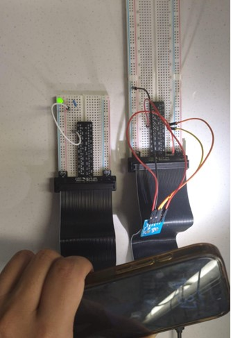

# IoT-Based Intelligent Light Monitoring and Automatic Control System

An IoT-based smart lighting system that automatically controls illumination based on ambient light intensity using MQTT communication between distributed nodes.

---

##  Project Overview

This project demonstrates a real-world **automatic lighting system** similar to those used in:

- Smart street lighting systems  
- Smart homes  
- Industrial energy-saving systems  
- Building automation  

The system continuously monitors ambient light using a sensor node and automatically controls an LED actuator node based on brightness levels.

Communication between devices is handled using the **MQTT (Message Queuing Telemetry Transport)** protocol, enabling real-time publish–subscribe messaging.

---

##  System Architecture

The system consists of two Raspberry Pi nodes:

###  1. Sensor Node (Publisher)
- Raspberry Pi Zero 2W
- Pmod ALS Ambient Light Sensor
- Reads light intensity using SPI
- Publishes brightness values (0–1023) via MQTT every second

###  2. Actuator Node (Subscriber)
- Raspberry Pi Zero 2W
- LED + 220Ω resistor
- Subscribes to brightness topic
- Turns LED ON if brightness > 500
- Turns LED OFF if brightness ≤ 500

---

##  How It Works

1. The sensor node measures ambient light.
2. The brightness value is sent to the MQTT broker.
3. The actuator node receives the value.
4. If the environment is dark → LED turns ON.
5. If the environment is bright → LED turns OFF.

This mimics real-world dark-activated lighting systems.

---

##  Hardware Components

### Sensor Node
- Raspberry Pi Zero 2W  
- Pmod ALS Light Sensor  
- Breadboard  
- Jumper wires  

### Actuator Node
- Raspberry Pi Zero 2W  
- LED  
- 220 Ω resistor  
- Breadboard  
- Jumper wires  

---

##  Software Technologies

- Python  
- pigpio (SPI communication)  
- paho-mqtt (MQTT communication)  
- RPi.GPIO (LED control)  

---

##  Hardware Setup

| Sensor Node | Actuator Node |
|------------|--------------|
|  |  |

---

##  Implementation

### Publisher Script
* **File:** [`team_1_publisher.py`](./codes/publisher_light_sensor.py)

- Opens SPI channel (1 MHz)
- Reads 2 bytes from sensor
- Performs bit manipulation
- Publishes brightness value via MQTT

### Subscriber Script
* **File:** [`team_2_subscriber.py`](./codes/subscriber_led_control.py)

- Subscribes to MQTT topic
- Compares brightness with threshold (500)
- Controls LED accordingly

---

##  Results

The system successfully demonstrated real-time IoT communication.

- Low light → LED OFF  
- High light → LED ON  

When a flashlight was pointed at the sensor, the LED turned ON instantly.  
When the sensor was covered, the LED turned OFF.

| MQTT Communication | LED Response |
|--------------------|--------------|
|  |  |

The communication between nodes was stable and responsive.

---

##  Key Learning Outcomes

- Understanding MQTT publish–subscribe architecture  
- Implementing SPI communication on Raspberry Pi  
- Processing binary sensor data using bit manipulation  
- Building a real-world IoT sensing and actuation system  
- Integrating hardware and software in distributed systems  

##  Real-World Application
This system models a **Smart Street Lighting** application. A single central light sensor can broadcast "night" or "day" status to an entire network of street lights. This allows for automated, energy-efficient control where lamps only consume power when ambient light levels are low.

---

##  Project Contents
* **Python Scripts:** [codes](./codes)
* **Full Report:** [Lab6_Final_Report.pdf](./report/Lab6_Final_Report.pdf)
* **Media Folder:** [/media/](./media) (7 Figures)
* **Dependencies:** [requirements.txt](./requirements.txt)

---

##  Installation & Setup
1. **Install MQTT:** `sudo apt install python3-paho-mqtt`
2. **Start pigpio:** `sudo pigpiod`
3. **Run Publisher:** `python3 codes/team_1_publisher.py`
4. **Run Subscriber:** `python3 codes/team_2_subscriber.py`

***

