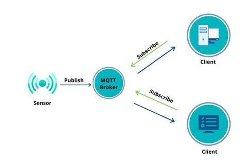
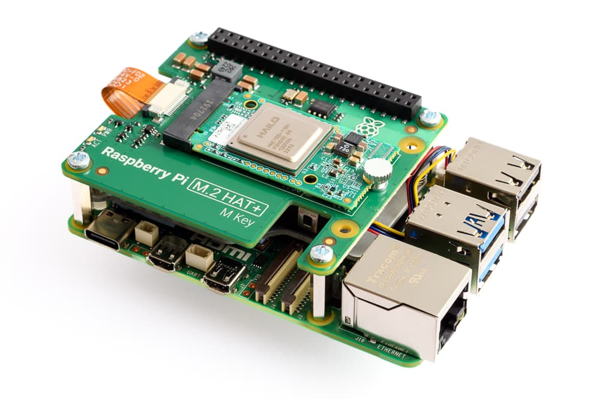
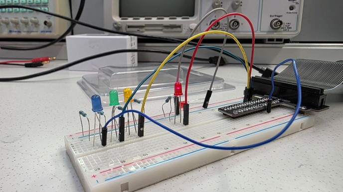
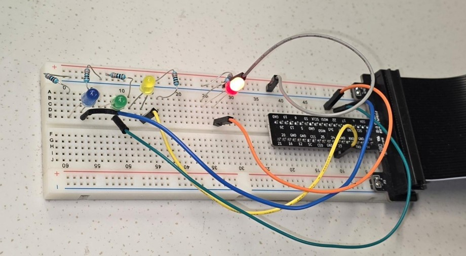
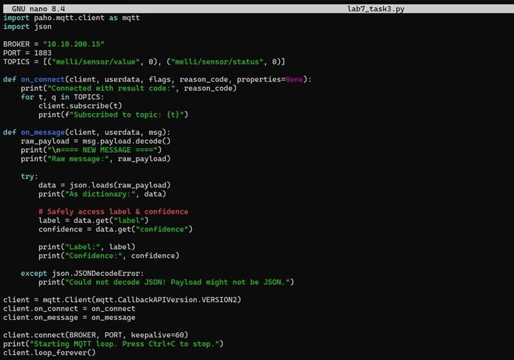
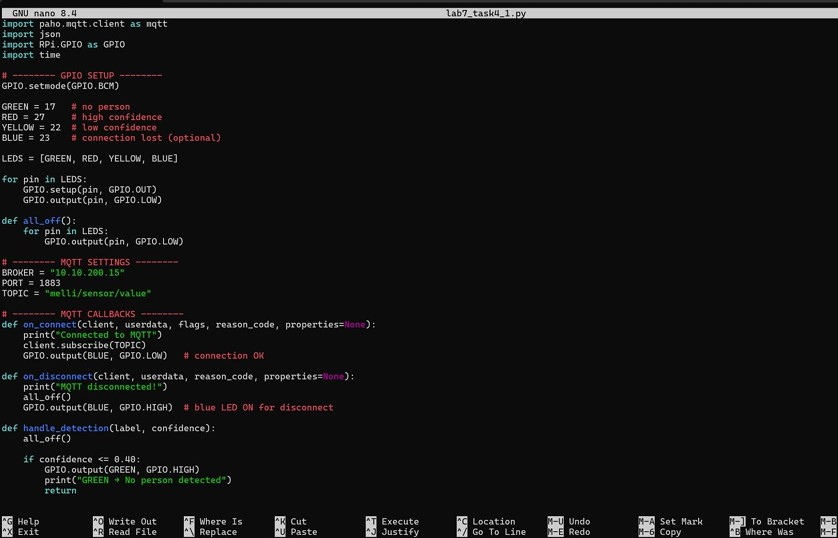
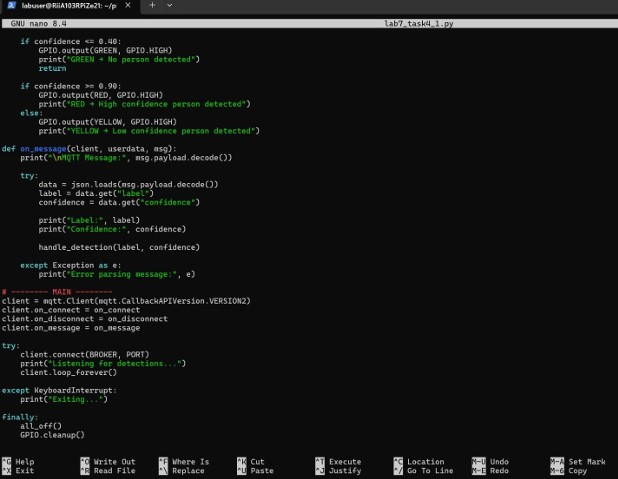
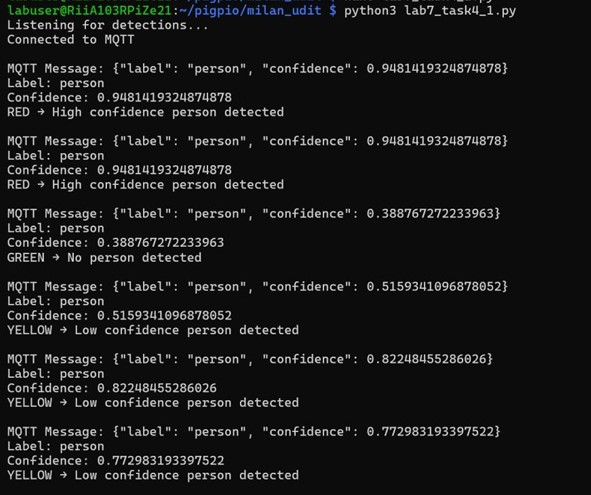

#  Raspberry Pi 5 Hailo AI Detection via MQTT  
### Lab 7 – Controllers and Electronics  

**Course:** Controllers and Electronics  
**Laboratory Work:** Lab 7 – Raspberry Pi 5 Hailo AI Detection via MQTT  
**Platform:** Raspberry Pi 5 (Hailo AI Kit) & Raspberry Pi Zero 2W  
**Date:** 15.12.2025  

**Group Members:**
- Dipen Gaihre   
- Milan Khadka  
- Udit Bhattarai  
 

> This laboratory experiment was carried out by university students as part of a practical lab session.  
> AI tools were used strictly as writing assistants and to support structured code development during the lab work.

---

#  Project Overview

This project demonstrates how **AI-based person detection** running on a Raspberry Pi 5 with a Hailo AI accelerator can communicate detection results via **MQTT** to an IoT edge device (Raspberry Pi Zero 2W), which then reacts by controlling physical LEDs.

The system integrates:

- Edge AI inference (Hailo AI accelerator)
- MQTT publish/subscribe communication
- JSON data parsing
- GPIO-based LED control
- Real-time system response

---

#  Objectives

The main objectives of this laboratory work were:

- To understand MQTT publish/subscribe communication
- To process AI-generated JSON data
- To implement real-time IoT response using GPIO
- To combine AI inference with embedded electronics

Expected outcome:  
A working real-time system where AI person detection controls LED indicators via MQTT communication.

---

#  System Architecture

## MQTT Communication Model

- **Publisher:** Raspberry Pi 5 + Hailo AI pipeline  
- **Subscriber:** Raspberry Pi Zero 2W  
- **Broker IP:** `10.10.200.15`  
- **Topics Used:**
  - `melli/sensor/value`
  - `melli/sensor/status`

### MQTT Architecture Diagram



---

#  Raspberry Pi 5 with Hailo AI Kit

The Raspberry Pi 5 was equipped with a **Hailo-8L AI acceleration module**, enabling real-time neural network inference.

Advantages:
- Real-time AI performance
- Low power consumption
- Edge processing (no cloud dependency)
- High detection accuracy

### Pi 5 with Hailo Setup



---

#  Example Detection Message (JSON)

```json
{"label": "person", "confidence": 0.82}
```

- `label` → detected object  
- `confidence` → probability (0.0 – 1.0)

---

#  Hardware Setup (Raspberry Pi Zero 2W)

## Components Used

- Raspberry Pi Zero 2W
- Breadboard
- 4 LEDs (Red, Green, Yellow, Blue)
- 220–330Ω resistors
- Jumper wires

### Wiring Setup



### Real Circuit Output



---

#  Tasks Performed in Lab 7

---

#  Task 1 – Understanding MQTT Data

We analyzed the JSON structure sent by the Raspberry Pi 5.

## LED Logic Rules

| Condition | LED |
|------------|------|
| No person detected |  Green |
| Person detected (confidence ≥ 0.75) |  Red |
| Person detected (confidence < 0.75) |  Yellow |
| MQTT connection lost |  Blue |

---

#  Task 2 – MQTT Subscriber Implementation

We implemented a subscriber using `paho-mqtt` on Raspberry Pi Zero 2W.

### Code  
[`mqtt-subscriber-task2.py`](codes/mqtt-subscriber-task2.py)

### Code Screenshot


### Terminal Output


---

#  Task 3 – JSON Parsing

Incoming MQTT payloads were parsed into Python dictionaries using `json.loads()`.

### Code  
[`json-parsing-task3.py`](codes/json-parsing-task3.py)

### Code Screenshot



---

#  Task 4 – LED Indicator Logic

GPIO control was implemented using `pigpio`.

LED control logic was extended to respond dynamically to AI detection confidence values.

### Code Files

- [`led-logic-task4.py`](codes/led-logic-task4.py)

### Code Screenshots

  


### Terminal Output



---

#  Task 5 – Managing IoT AI Application Quality

We evaluated system quality based on:

- **Accuracy** – Correct person detection  
- **Reliability** – Stable MQTT communication  
- **Latency** – Time between detection and LED response  
- **Robustness** – Performance under different lighting conditions  
- **Energy Efficiency** – Edge AI optimization  

If performance degrades, improvements include:

- Adjusting confidence threshold  
- Improving lighting conditions  
- Optimizing MQTT reconnection logic  
- Replacing or retraining the AI model  

---

#  Results and Analysis

- MQTT communication worked reliably  
- JSON parsing was successful  
- LED logic responded correctly to detection confidence  
- Minor latency observed (network-related)  
- No major system crashes occurred  

The system performed as expected during laboratory testing.

---

#  Real-World Applications

This project demonstrates a practical **Edge AI + IoT system**, applicable in:

- Smart security systems  
- Smart building automation  
- Occupancy monitoring  
- Industrial safety detection  
- Energy-saving lighting systems  
- Smart retail analytics  

Because inference runs locally on the Raspberry Pi 5 with Hailo AI, the system:

- Reduces latency  
- Preserves privacy  
- Minimizes cloud dependency  
- Improves energy efficiency  

This architecture is highly relevant for modern embedded AI systems.

---

#  Conclusion

This laboratory work successfully integrated:

- AI inference (Hailo accelerator)  
- MQTT communication  
- JSON data processing  
- Embedded GPIO control  

Through this experiment, we gained practical experience in:

- Publish/subscribe architectures  
- Real-time embedded system design  
- Edge AI deployment  
- IoT system debugging and validation  

This project reflects hands-on laboratory work performed by university engineering students in an embedded systems laboratory environment.

---

##  Project Contents
* **Python Scripts:** [codes](./codes)
* **Full Report:** [Lab7_Final_Report.pdf](./report/Lab-7-report.pdf)
* **Media Folder:** [/media/](./media)
* **Dependencies:** [requirements.txt](./requirements.txt)
---

#  References

- Controllers and Electronics – Lab 7 Instructions  
- HAMK – A Good Lab Report Guidelines  
- MQTT Documentation  
- Hailo AI Documentation  

---
